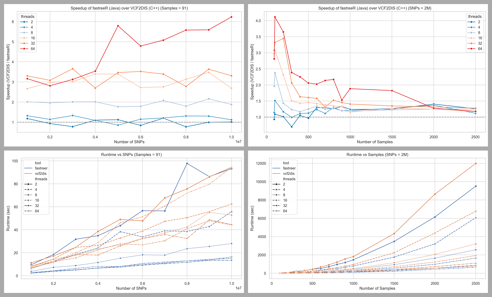

# fastreeR Benchmark

This folder contains benchmarks comparing **fastreeR** with **VCF2Dis**, conducted independently by the developer of fastreeR (Anestis Gkanogiannis, Ph.D.).

## Key Highlights

- fastreeR has undergone major improvements since early 2024.
- The current version (2.0.0) now supports fully streamed execution, removing prior RAM pre-allocation constraints.
- Benchmarks demonstrate that fastreeR scales faster than VCF2Dis while maintaining accuracy, even for large datasets.

## Benchmark Description

- Benchmarks include datasets of varying sizes (sample count × variant count).
- All tests were run using the most recent versions of the tools and under identical system conditions.

## 📊 Plots

> Graphs illustrate how fastreeR surpasses VCF2Dis across datasets.

## Contents

- `0.get_software.sh`: Script to download and prepare both software.
- `0.get_vcfs_prepare_subsets.sh`: Script to download vcf test dataset.
- `1.run_benchmark_varSNPs_varSams_multi.sh`: Script to reproduce the benchmark.
- `2.parse_logs.py`: Script to parse the output logs of bot software.
- `3.plot.py`: Script to create the plots from logs.
  `benchmark_logs_link.txt`: Link for downloading original log files.
  `benchmark_logs.csv`: Parsed benchmark logs.
- `plots/`: Visual comparison charts.
- `benchmark_logs/`: Raw execution logs for transparency.

## ⚠️ Purpose & Context

These results are presented in response to previously published, but flawed, benchmarking comparisons. For further details, see:
- https://github.com/hewm2008/VCF2Dis/issues/3
- https://github.com/BGI-shenzhen/VCF2Dis/issues/7

## License

This benchmark and related scripts are released under the MIT License.

## Contact

Anestis Gkanogiannis  
Email: [anestis@gkanogiannis.com]  
GitHub: https://github.com/gkanogiannis/fastreeR
